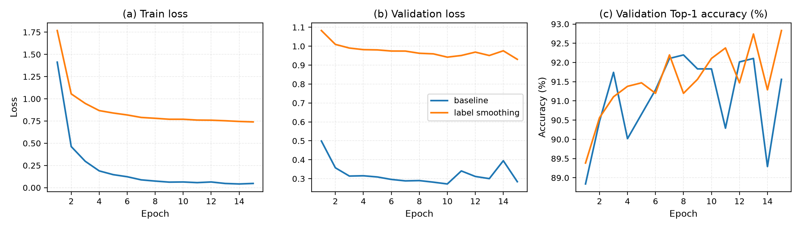
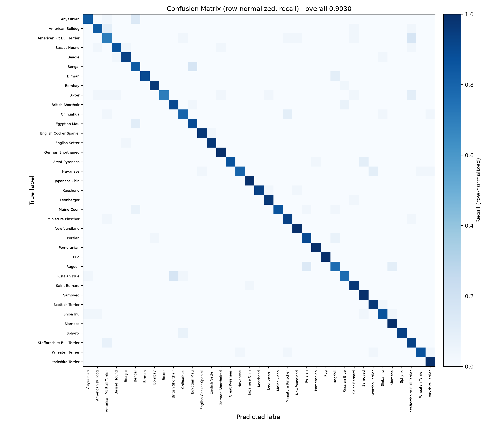
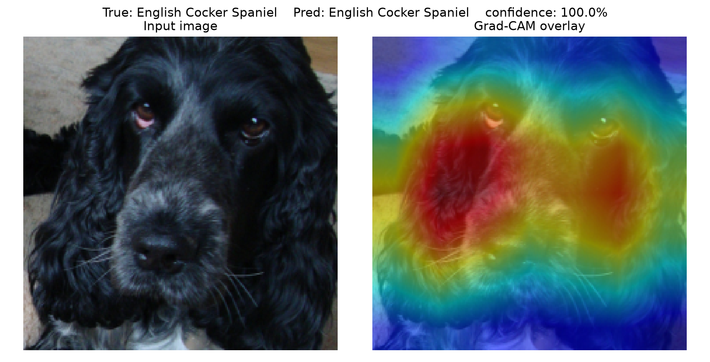
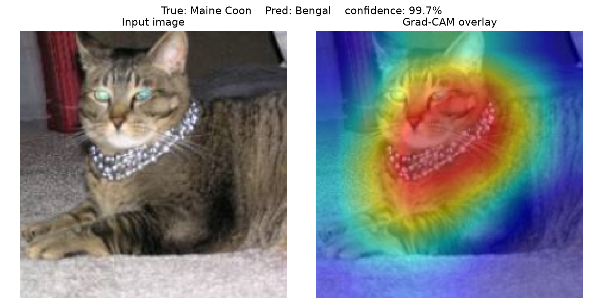

# 基于深度学习的牛津宠物细粒度图像分类（Oxford-IIIT Pet，37 类）

科研项目组 72 小时考核的交付仓库。以 ImageNet 预训练的 **ResNet-18** 为基线，完成
Oxford-IIIT Pet 37 类猫、狗品种的细粒度分类，并做了一组单变量消融实验
（标准交叉熵 vs. Label Smoothing），包含训练日志、混淆矩阵与 Grad-CAM 可视化。

## 1. 数据集与预处理

| 项目 | 说明 |
| :--- | :--- |
| 数据集 | Oxford-IIIT Pet，37 类，共 **7349 张**（官方 `trainval` 3680 + `test` 3669，合并后重新划分） |
| 划分方式 | 分层抽样（Stratified）**70 : 15 : 15**，`seed=42` → 训练 **5144** / 验证 **1102** / 测试 **1103** |
| 训练集预处理 | `Resize(256)` + `RandomCrop(224)` + `RandomHorizontalFlip` + `Normalize` |
| 验证/测试预处理 | `Resize(256)` + `CenterCrop(224)` + `Normalize`（**确定性，不含任何随机增强**） |
| 标签 | torchvision 已转成 `0~36`，可直接配合 `nn.CrossEntropyLoss()` |

> 数据集体积约 800 MB，**不随仓库提交**。`python data/dataset.py` 或 `train.py` 会自动下载；
> 若官方源太慢，可手动下载 `images.tar.gz` / `annotations.tar.gz` 解压成
> `data/oxford-iiit-pet/{images,annotations}/` 后再运行。

## 2. 环境要求

- Python 3.12，PyTorch 2.x（实测 `torch 2.14.0+cu126` / `torchvision 0.29.0+cu126`）
- 实测硬件：RTX 4060 Laptop 8 GB / Ryzen 9 7945HX / 16 GB / Windows 11
- 单次 15 轮训练约 **8.6 分钟**（batch size 32，224×224）；CPU 也能跑通，只是慢一些

## 3. 目录结构

```text
petproject/
├── data/
│   └── dataset.py        # 数据加载、分层划分与 Transform
├── models/
│   └── model.py          # 模型定义与 Head 替换（ResNet-18 → 37 类）
├── utils/
│   ├── metrics.py        # Top-1/Top-5、Macro-F1、混淆矩阵绘制
│   └── gradcam.py        # Grad-CAM 可视化工具
├── train.py              # 训练主入口（argparse 控制超参数）
├── evaluate.py           # 评估与生成可视化结果的独立脚本
├── plot_curves.py        # 由 history.csv 画训练曲线
├── requirements.txt      # 依赖清单
├── README.md             # 项目说明与一键复现命令
├── logs/                 # TensorBoard 日志 + 每轮指标 history.csv
├── results/              # 混淆矩阵、Grad-CAM、训练曲线与指标 json
└── report/               # 考核技术报告 PDF（2~3 页）
```

## 4. 一键复现

```bash
# 1) 安装依赖
pip install -r requirements.txt

# 2) 训练基线（ResNet-18 + AdamW，15 轮）
python train.py --epochs 15 --batch_size 32 --lr 1e-4 --exp_name baseline

# 3) 在留出测试集上评估，并生成混淆矩阵与 Grad-CAM
python evaluate.py --ckpt best_model_baseline.pth --name baseline
```

消融实验（只改损失函数，其余超参与随机种子保持一致）：

```bash
python train.py --epochs 15 --batch_size 32 --lr 1e-4 --loss ls --exp_name label_smoothing
python evaluate.py --ckpt best_model_label_smoothing.pth --name label_smoothing
```

查看训练曲线（TensorBoard）：

```bash
tensorboard --logdir logs        # 浏览器打开 http://localhost:6006
python plot_curves.py --runs baseline label_smoothing --out results/curves.png
```

关键参数：`--epochs`、`--batch_size`、`--lr`、`--loss {ce,ls}`、`--exp_name`、
`--seed`、`--data_dir`、`--out`、`--download/--no-download`（数据集缺失时是否自动下载，
默认开启）；评估脚本另有 `--ckpt`、`--name`、`--out`。

环境自检（答辩抽查的 Tensor 维度问题也能在这里验证）：

```bash
python data/dataset.py     # 打印 batch 形状 [32, 3, 224, 224]、标签范围 [0, 36]、验证集 transform
python models/model.py     # 打印最后卷积层输出 [2, 512, 7, 7] 与分类头输出 [2, 37]
```

## 5. 实验结果

测试集 1103 张，指标由 `evaluate.py` 在确定性预处理下计算，可重复复现。

| 实验配置 | Top-1 Acc (%) | Top-5 Acc (%) | Macro-F1 | 最佳轮次 | 训练耗时 |
| :--- | :---: | :---: | :---: | :---: | :---: |
| Baseline（ResNet-18 + 基础增强） | 90.30 | 99.00 | 0.903 | 8 / 15 | 8.6 min |
| 改进组（+ Label Smoothing 0.1） | **92.38** | 98.55 | **0.923** | 15 / 15 | 8.6 min |



Baseline 训练第 5 轮后训练集精度已接近 99%，但验证损失停在 0.31 附近不再下降，
训练与验证精度始终相差约 7.4 个百分点，属于明显过拟合；加入 Label Smoothing 后
训练损失下限被抬到约 0.75（软化标签的理论下限），训练/验证曲线间距缩小，
验证精度一直提升到第 15 轮，测试集 Top-1 提升 **+2.09 个百分点**。

### 错误分析



混淆矩阵整体对角占优（37 类召回率中位数 92.9%），错误集中在毛色斑纹相近的品种之间：

| 类别对 | 混淆样本数 |
| :--- | :---: |
| Bengal 与 Egyptian Mau | 8 |
| American Pit Bull Terrier 与 Staffordshire Bull Terrier | 7 |
| British Shorthair 与 Russian Blue | 7 |
| Persian 与 Ragdoll | 6 |

召回率最低的两类是 American Pit Bull Terrier（70.0%）与 Boxer（70.0%），是拉低 Macro-F1 的主要来源。

### Grad-CAM 可视化




预测正确的样本中，热力图集中在口鼻、眼部与耳部轮廓（品种判别性特征）；
预测错误的样本（Maine Coon 误判为 Bengal）中，网络被额部虎斑纹路以及与品种无关的
颈部珠串项圈吸引，说明模型仍会受到背景与个体外观的干扰。

## 6. 复现与踩坑记录

1. **验证/测试集不能有随机增强**：早期版本用 `Subset` 划分数据后直接执行
   `train_dataset.dataset.transform = train_transform`，而三个 Subset 共享同一个底层
   Dataset 对象，导致验证/测试集也被套上 `RandomCrop + RandomHorizontalFlip`。
   现在由 `TransformSubset` 让每个 split 各自持有 transform；同一权重在随机增强下评估
   Top-1 为 89.45%（重复 5 次波动 ±0.42 个百分点），改成确定性 CenterCrop 后稳定在 90.30%。
2. **数据划分要覆盖全部 7349 张**：早期版本只用 `split="trainval"`（3680 张），与任务书
   要求不符，现已合并 `trainval` 与 `test` 后再做分层抽样。
3. **评估必须 `model.eval()` + `torch.no_grad()`**，训练每步 `optimizer.zero_grad()` 放在
   `loss.backward()` 之前；`nn.CrossEntropyLoss()` 自带 Softmax，模型输出层不再加 Softmax。
4. `seed=42` 在所有对比实验间保持一致，评估脚本使用确定性预处理，因此指标可重复。

## 7. 技术报告

2~3 页精简报告见 [`report/【考核】蒋永胜_W124301172_宠物分类.pdf`](report/)。
